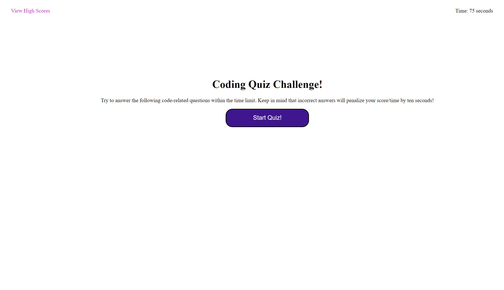

# Kate Steed Code Quiz

## Description

This is the weekly project for Module 4: Web APIs. Our challenge this week was to build a functional, multiple choice quiz which would also save the data it gathered and display it. My version of this project does not display the saved data yet (I plan to fix this later), but it does have a functional start page and timer, and displays 5 multiple choice questions as the player answers them. This project provided students with an opprotunity to hone in on their html and css skills, as well as further develop new skills in javascript.

## Instaliation
N/A

## Usage

The quiz is very user friendly and simple to use. Simply load up the quiz through the provided link to be taken to the starting page. Clicking the start button will start the quiz. In the future, you will be able to save your scores to a scoreboard, found in the highscore link on the starting page.

https://ksteed8859.github.io/KS-Code-Quiz/

## Credits
N/A

## License
N/A
